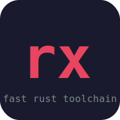

<p align="center">
  
</p>

<h1 align="center">rx</h1>

<p align="center">
  <a href="https://github.com/iPeluwa/rx/actions/workflows/ci.yml"></a>
  <a href="https://github.com/iPeluwa/rx/releases"></a>
  <a href="LICENSE"></a>
</p>

<p align="center">A fast, unified Rust toolchain manager. One binary to replace the fragmented Rust CLI ecosystem.</p>

## Why

The Rust toolchain is powerful but fragmented. You need `rustup`, `cargo`, `clippy`, `rustfmt`, `cargo-nextest`, `cargo-watch`, `sccache` — all installed separately, versioned independently, and configured in different places. Build times are slow, `target/` directories are massive, and workspace support is clunky.

**rx** wraps and extends Cargo into a single, opinionated CLI with:

- **Fast builds** — auto-detects `mold`/`lld` linkers, caches detection results persistently
- **Global artifact cache** — content-addressed store with xxHash fingerprinting, atomic writes, file locking, and mtime fast-path
- **Remote cache** — share build artifacts across CI runners via S3, GCS, or local path
- **Semantic fingerprinting** — only rebuild when public API changes, not on comment edits
- **Pipelined builds** — overlap type-checking with codegen in workspace builds
- **Cross-compilation** — `rx build --target <triple>` for easy cross-compiling
- **Workspace orchestration** — dependency-aware parallel execution across workspace members
- **Unified commands** — `rx test` uses nextest when available, `rx lint` runs clippy with strict defaults, `rx fmt` runs rustfmt
- **One-command CI** — `rx ci` runs your full pipeline locally (fmt, clippy, test, build)
- **Auto-fix everything** — `rx fix` applies compiler suggestions, clippy fixes, and formatting in one step
- **Smart test orchestration** — failure-based ordering, parallel sharding, flaky test detection
- **MSRV checking** — `rx compat` verifies code and deps work on your declared rust-version
- **Build sandbox** — isolated builds to detect undeclared dependencies
- **Background daemon** — persistent process holds workspace state for instant command startup
- **Persistent workers** — pre-warmed check/fmt/lint processes for zero cold-start
- **Project config** — `rx.toml` with profiles, scripts, env vars, and config validation
- **Project templates** — `rx new --template axum/cli/wasm/lib` for opinionated scaffolding
- **Release automation** — `rx release patch` bumps version, commits, tags, and pushes
- **Native file watcher** — `rx watch` uses `notify` directly, no cargo-watch dependency
- **Coverage reports** — `rx coverage` with `--lcov` for CI and `--open` for local dev
- **Affected-only testing** — `rx test --affected` only tests packages changed since a base ref
- **Private registries** — configure and authenticate with private crate registries
- **Lockfile policy** — enforce lockfile health and consistency for CI
- **Plugin system** — drop executables in `~/.rx/plugins/` and run them with `rx plugin run`
- **Build stats** — `rx stats show` tracks build time trends across sessions
- **Telemetry** — opt-in anonymous usage analytics, stored locally
- **Context-aware completions** — workspace members, installed targets, toolchains, and scripts
- **Colored output** — clear, color-coded status messages with timing and progress indicators
- **Actionable errors** — every failure includes hints on how to fix it (25+ error codes)
- **Self-updating** — `rx self-update` updates rx to the latest version

## Install

### One-liner

```sh
curl -fsSL https://raw.githubusercontent.com/iPeluwa/rx/master/install.sh | sh
```

This downloads a prebuilt binary for your platform (Linux, macOS, Windows/MSYS), or falls back to `cargo install` from source.

### From source

```sh
cargo install --path .
```

### GitHub Action

```yaml
- uses: iPeluwa/rx@v1
  with:
    command: ci
```

### VS Code Extension

Install from `editors/vscode/` — provides 15 commands, task provider, auto-check on save, and problem matchers.

### Shell completions

```sh
# Bash (includes dynamic completions for workspace members, targets, scripts)
rx completions bash >> ~/.bashrc

# Zsh
rx completions zsh >> ~/.zshrc

# Fish
rx completions fish > ~/.config/fish/completions/rx.fish

# PowerShell
rx completions powershell >> $PROFILE
```

## Quick start

```sh
rx new myproject               # new binary project
rx new myapi --template axum   # new axum web project
rx new mycli --template cli    # new clap CLI project
cd myproject
rx run
```

## Commands

| Command | Description |
|---|---|
| `rx init` | Generate `rx.toml` with smart defaults |
| `rx init --migrate` | Auto-detect project settings from existing tools |
| `rx init --ci` | Also generate `.github/workflows/ci.yml` |
| `rx config` | Show resolved configuration |
| `rx new <name>` | Create a new Rust project |
| `rx new <name> --template <t>` | Create from template: `axum`, `cli`, `wasm`, `lib` |
| `rx build` | Build with fast linker + caching |
| `rx build --target <triple>` | Cross-compile for a target triple |
| `rx run [-- args...]` | Build and run (args pass through to binary) |
| `rx check` | Type-check without building (fast feedback) |
| `rx test` | Run tests (nextest if available) |
| `rx test --affected` | Only test packages changed since base ref |
| `rx test-smart` | Smart test ordering with failure history and sharding |
| `rx fmt` | Format code |
| `rx lint` | Lint with clippy |
| `rx fix` | Auto-fix everything (compiler + clippy + fmt) |
| `rx ci` | Run full CI pipeline locally |
| `rx compat` | Check MSRV compatibility of code and dependencies |
| `rx sandbox` | Sandboxed build to detect undeclared dependencies |
| `rx bench` | Run benchmarks |
| `rx expand` | Expand macros (requires cargo-expand) |
| `rx publish` | Publish crate(s) to crates.io |
| `rx release <ver>` | Bump version, commit, tag, and push |
| `rx coverage` | Generate code coverage report |
| `rx size` | Show binary size (+ cargo-bloat breakdown) |
| `rx bloat` | Analyze binary bloat by function or crate |
| `rx tree` | Show dependency tree |
| `rx deps` | Dependency health dashboard (tree + outdated + audit) |
| `rx outdated` | Check for outdated dependencies |
| `rx audit` | Audit dependencies for security vulnerabilities |
| `rx doc` | Build documentation |
| `rx doctor` | Check your development environment |
| `rx upgrade` | Update toolchains and dependencies |
| `rx self-update` | Update rx to the latest version |
| `rx completions <shell>` | Generate shell completions |
| `rx manpage` | Generate man page |
| `rx explain <code>` | Explain a Rust error code with practical fixes |
| `rx script <name>` | Run a script defined in rx.toml |
| `rx sbom` | Generate Software Bill of Materials (SPDX/CycloneDX) |
| `rx pkg add/remove/upgrade/list/why/dedupe/compat` | Manage dependencies |
| `rx toolchain install/use/list/update` | Manage Rust toolchains |
| `rx cache status/gc/purge` | Manage the global artifact cache |
| `rx ws list/graph/run/script/exec` | Workspace orchestration |
| `rx watch` | Watch for changes and rebuild (native, no cargo-watch) |
| `rx clean` | Clean build artifacts |
| `rx env show/shell` | Manage environment variables from rx.toml |
| `rx plugin list/run` | Manage and run plugins |
| `rx stats show/clear` | View or clear build time statistics |
| `rx daemon start/stop/status/ping` | Manage the background daemon |
| `rx registry login/list/add` | Manage private crate registries |
| `rx lockfile check/enforce` | Check lockfile health and enforce policies |
| `rx telemetry on/off/status` | Manage anonymous usage telemetry |
| `rx worker warm/status/stop` | Manage persistent background workers |
| `rx test-advanced snapshot/fuzz/mutate` | Advanced testing strategies |

### Global flags

| Flag | Description |
|---|---|
| `--quiet` / `-q` | Suppress non-error output |
| `--verbose` / `-v` | Show extra detail (cache paths, timing, etc.) |
| `--profile <name>` | Use a config profile (e.g. `--profile ci`) |

All commands support these flags. For example:

```sh
rx --quiet build --release    # silent build
rx --verbose test             # show timing and debug info
rx --profile ci test          # use CI profile overrides
```

## Configuration

Run `rx init` to generate an `rx.toml`. Smart defaults are applied based on your project — workspaces get a `ci` script, and if `mold` is available it's set as the default linker. Unknown keys in `rx.toml` produce a warning so typos don't silently fail.

Use `rx init --migrate` to auto-detect your project's existing tools (linkers, nextest, Makefiles, benchmarks, error handling crates) and generate a tailored config.

```toml
[build]
linker = "auto"            # "auto", "mold", "lld", or "system"
rustflags = []             # extra RUSTFLAGS
cache = true               # enable global artifact cache
jobs = 0                   # parallel jobs (0 = auto)
incremental_link = true    # enable incremental linking optimizations
remote_cache = ""          # remote cache URL: "s3://bucket/prefix", "gs://bucket/prefix", or "/path"

[test]
runner = "auto"            # "auto", "nextest", or "cargo"
extra_args = []

[lint]
severity = "deny"          # "deny", "warn", or "allow"
extra_lints = []           # e.g. ["clippy::pedantic"]

[fmt]
extra_args = []

[watch]
cmd = "build"              # default command on file changes
ignore = []                # file patterns to ignore (e.g. ["*.log", "tmp/**"])

[scripts]
ci = "cargo fmt --check && cargo clippy -- -D warnings && cargo test"
bench = "cargo bench"

[env]
RUST_BACKTRACE = "1"
```

### Config profiles

Override settings per context with `[profile.<name>]`:

```toml
[profile.ci]
build = { cache = false, jobs = 2 }
lint = { severity = "deny" }
test = { runner = "nextest" }
env = { CI = "true" }
```

Use with `rx --profile ci build`.

Config is resolved by merging `~/.rx/config.toml` (global) with the project's `rx.toml`. Project values override global.

## Smart test orchestration

```sh
rx test-smart                      # run tests, failed-first ordering
rx test-smart --shards 4           # distribute across 4 parallel shards
rx test-smart --release            # release mode
```

Tests are ordered by failure history (previously-failing tests run first, fastest tests first). History is persisted at `~/.rx/test-history.json` and failure counts decay on success.

## MSRV compatibility

```sh
rx compat                          # check code + deps against rust-version
rx pkg compat                      # same, via pkg subcommand
```

Reads `rust-version` from Cargo.toml, installs the MSRV toolchain if needed, runs `cargo check --all-targets` with it, and verifies dependency MSRV compatibility via cargo metadata.

## Build sandbox

```sh
rx sandbox                         # sandboxed debug build
rx sandbox --release               # sandboxed release build
```

Runs `cargo build` with `env_clear()` and only essential environment variables (HOME, CARGO_HOME, RUSTUP_HOME, minimal PATH). Detects undeclared dependencies on globally-installed tools or env vars.

## Background daemon

```sh
rx daemon start                    # start in foreground
rx daemon stop                     # stop running daemon
rx daemon status                   # check if daemon is running
rx daemon ping                     # verify daemon responds
```

The daemon (`rxd`) holds workspace state in memory (config, dependency graph, fingerprint cache) and communicates via Unix socket at `~/.rx/rxd.sock`. Eliminates cold-start overhead for repeated commands.

## Private registries

```sh
rx registry list                   # show configured registries
rx registry add my-reg https://index.example.com
rx registry login my-reg           # interactive auth
rx registry login my-reg tok123    # token auth
```

## Lockfile policy

```sh
rx lockfile check                  # check existence, freshness, git status, format
rx lockfile enforce                # CI: fail if Cargo.lock is out of sync
```

## Persistent workers

```sh
rx worker warm                     # pre-start check, fmt, lint workers
rx worker status                   # show active worker processes
rx worker stop                     # kill all workers
```

## Telemetry

```sh
rx telemetry on                    # opt in to anonymous local telemetry
rx telemetry off                   # opt out
rx telemetry status                # show collected data
```

Telemetry is **off by default**. Data is stored locally at `~/.rx/telemetry.json` and never sent automatically.

## Project templates

Create new projects from opinionated templates:

```sh
rx new myapi --template axum     # Axum web API with tokio, serde, tracing
rx new mycli --template cli      # Clap CLI with anyhow error handling
rx new mywasm --template wasm    # wasm-bindgen library with tests
rx new mylib --template lib      # Library with doc tests and MIT/Apache-2.0
```

Each template creates a complete project with `Cargo.toml`, source files, `.gitignore`, and git init.

## Release automation

```sh
rx release patch                 # bump 0.1.0 -> 0.1.1, commit, tag, push
rx release minor                 # bump 0.1.0 -> 0.2.0
rx release major                 # bump 0.1.0 -> 1.0.0
rx release 2.0.0                 # set explicit version
rx release patch --dry-run       # preview without changes
rx release patch --no-push       # commit and tag, but don't push
```

## Coverage

```sh
rx coverage                      # HTML report (uses cargo-llvm-cov or tarpaulin)
rx coverage --open               # build and open in browser
rx coverage --lcov               # LCOV output for CI (writes lcov.info)
```

## Affected-only testing

```sh
rx test --affected               # test packages changed since HEAD~1
rx test --affected --base main   # test packages changed since main branch
```

Maps changed files from `git diff` to workspace members and only runs tests for affected packages.

## Cache

rx maintains a global content-addressed artifact cache at `~/.rx/cache`. The cache is designed for correctness even under concurrent use:

1. An **mtime fast-path** checks if any source file has changed since the last build — if nothing changed, the cached fingerprint is reused instantly without reading file contents
2. On mtime mismatch, a full **xxHash (xxh3-128)** fingerprint is computed from `Cargo.toml`, `Cargo.lock`, all source files, the build profile, and RUSTFLAGS
3. If a cached build matches the fingerprint, artifacts are **reflinked** (CoW on APFS/btrfs) or hardlinked back into `target/` — skipping `cargo build` entirely
4. On cache miss, the build runs normally and results are stored for future use
5. **Remote cache** can push/pull artifacts to S3, GCS, or a shared local path for team builds

**Integrity guarantees:**
- **Atomic writes** — cache index and mtime snapshots are written to a temp file then atomically renamed
- **File locking** — a lock file prevents concurrent `rx` processes from racing on the cache index
- **Staging directory** — new artifacts are written to a staging dir then renamed into place
- **Parallel operations** — cache store/restore uses rayon for parallel file copies

```sh
rx cache status    # show cache size and artifact count
rx cache gc        # remove artifacts older than 30 days
rx cache purge     # delete the entire cache
rx clean --gc      # clean local target/ and GC global cache
rx clean --all     # clean all workspace member target/ directories
```

## Workspace orchestration

For Cargo workspaces, `rx ws` provides dependency-aware execution:

```sh
rx ws list                  # list all workspace members
rx ws graph                 # show dependency graph
rx ws run build             # build all members in parallel waves
rx ws run test --release    # test all members in release mode
rx ws script ci             # run "ci" script from each member's rx.toml
rx ws exec "wc -l src/*.rs" # run a shell command in each member directory
```

Members are grouped into parallel "waves" based on the dependency graph (Kahn's algorithm for topological sort). Independent packages build concurrently; dependent packages wait for their dependencies to complete. Semantic fingerprinting skips rebuilding members whose public API hasn't changed.

## Performance

rx is built for speed:

- **xxHash (xxh3-128)** for fingerprinting — ~10x faster than SHA-256
- **Semantic fingerprinting** — only rebuilds when public API signatures change (via `syn` AST parsing)
- **Mtime fast-path** — skips content hashing entirely when no files have changed
- **Reflink (CoW) copy** — instant cache restore on APFS/btrfs, fallback to hardlink then copy
- **Parallel cache operations** — rayon-based parallel store/restore
- **Pipelined builds** — overlap downstream type-checking with upstream codegen
- **Persistent env cache** — linker detection results cached to `~/.rx/env.lock`, refreshed by `rx doctor`
- **Incremental linking** — split-debuginfo and `--as-needed` for faster link times
- **Native file watcher** — uses `notify` crate directly instead of spawning cargo-watch
- **PGO release builds** — Profile-Guided Optimization in the release CI pipeline
- **Optimized release binary** — thin LTO, single codegen unit, stripped symbols, panic=abort
- **Lazy config loading** — commands that don't need config skip loading it

## Architecture

```
rx (single binary, MSRV 1.85.0)
├── cli/               CLI definition (clap derive) with lazy config loading + profiles
├── config/            rx.toml parsing, global/project merge, profiles, validation
├── build/             cargo build with fast linker, cache, cross-compilation, incremental linking
├── cache/             content-addressed store with xxHash, atomic writes, parallel reflink/hardlink
├── remote_cache/      S3/GCS/local shared cache for teams
├── semantic_hash/     syn-based public API fingerprinting
├── pipeline/          pipelined workspace builds (check + build overlap)
├── cargo_output/      cargo JSON output parser with error hints
├── workspace/         dependency graph, topo sort (Kahn's), parallel wave execution
├── daemon/            background daemon with Unix socket IPC
├── worker/            persistent warm check/fmt/lint processes
├── output/            colored output, progress spinners, timing, verbosity control
├── watch/             native file watcher (notify crate), smart filtering, JSON integration
├── completions/       shell completions + context-aware dynamic completions
├── templates/         project templates (axum, cli, wasm, lib)
├── release/           version bumping, commit, tag, push automation
├── coverage/          code coverage (cargo-llvm-cov / tarpaulin, HTML + LCOV)
├── affected/          git-diff-based affected package detection
├── test_orchestrator/ smart test ordering, sharding, flaky detection
├── compat/            MSRV compatibility checking
├── sandbox/           isolated builds (env-stripped) for dependency detection
├── registry/          private crate registry configuration
├── lockfile/          lockfile health checking and CI enforcement
├── telemetry/         opt-in anonymous usage analytics (local only)
├── script/            rx.toml script runner
├── stats/             build time tracking and statistics
├── env/               environment variable management
├── plugin/            plugin discovery and execution
├── migrate/           auto-detection and config generation from existing projects
├── deps/              dependency health dashboard
├── bloat/             binary bloat analysis
├── hints/             25+ error code explanations with practical fixes
├── doc/               documentation builder with --watch
├── sbom/              SPDX and CycloneDX bill of materials generation
├── test_advanced/     snapshot, fuzz, and mutation testing
└── install.sh         self-installer script (Linux, macOS, Windows/MSYS)
```

## GitHub Action

Use rx in your CI with the official GitHub Action:

```yaml
- uses: iPeluwa/rx@v1
  with:
    version: latest        # rx version to install
    command: ci            # rx command to run
    cache: true            # cache Cargo artifacts
    rust-toolchain: stable # Rust toolchain to install
```

## VS Code Extension

The `editors/vscode/` directory contains a VS Code extension with:
- 15 commands (build, test, lint, fmt, fix, ci, etc.)
- Task provider for rx commands
- Auto-check on save
- Status bar with build status
- Problem matchers for Rust errors

## Testing

rx has 130+ tests across 5 test suites plus inline unit tests:

```sh
cargo test
```

| Suite | Coverage |
|---|---|
| `cache_tests` | Fingerprinting, cache hit/miss, store/restore |
| `cli_tests` | All 70+ CLI commands and flags parse correctly |
| `config_tests` | Config loading, merging, profiles, serialization |
| `integration_tests` | End-to-end: init, build, test, fmt, doctor, flags |
| `workspace_tests` | Topo sort, parallel waves, cycle detection |
| Unit tests | Semantic hashing, MSRV comparison, telemetry, workers, sandbox, remote cache |

CI runs on every push: check, test (ubuntu + macos), clippy, fmt, and MSRV verification.

## License

MIT — see [LICENSE](LICENSE).
