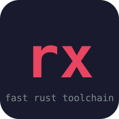

<p align="center">
  
</p>

<h1 align="center">rx</h1>

<p align="center">
  <a href="https://github.com/iPeluwa/rx/actions/workflows/ci.yml"></a>
  <a href="https://github.com/iPeluwa/rx/releases"></a>
  <a href="LICENSE"></a>
  <a href="https://ipeluwa.github.io/rx/"></a>
  <a href="https://github.com/iPeluwa/rx"></a>
</p>

<p align="center">Fast local CI and task runner for Rust workspaces. Define your pipeline once, run it the same way locally and in CI.</p>

> **Scope note:** rx has been refocused from a "unified toolchain manager" to a fast local-CI and task runner for Rust workspaces. See [PRODUCT.md](PRODUCT.md) for the product definition and explicit non-goals. The ~40 out-of-scope commands (toolchain management, release automation, SBOM, telemetry, plugins, daemon, and other satellites) were removed for 0.2 — use the dedicated tools (rustup, cargo-release, cargo-audit, sccache, …) directly, or invoke them from a configured rx task.

## Why

CI failures you could have caught locally waste round-trips, and every project reinvents the same fmt/clippy/test/build pipeline in shell scripts and YAML. **rx** gives a Rust workspace one task definition that runs identically on your machine and in CI, understands which packages are affected by a change, and delegates compilation to Cargo and Cargo-compatible tools.

**rx** offers:

- **One-command CI** — `rx ci` runs your full pipeline locally (fmt, clippy, test, build)
- **Task runner** — define tasks once in `[tasks]` with `depends-on` pipelines; run them with `rx run <task>` locally and in CI, independent tasks run concurrently
- **Affected-only testing** — `rx test --affected` only tests packages changed since a base ref
- **Workspace orchestration** — dependency-aware parallel execution across workspace members
- **Unified commands** — `rx test` uses nextest when available, `rx lint` runs clippy with strict defaults, `rx fmt` runs rustfmt
- **Fast builds** — auto-detects `mold`/`lld` linkers, caches detection results persistently
- **CI generation** — `rx init --ci` writes a GitHub/GitLab/Circle pipeline that mirrors your local one
- **Auto-fix everything** — `rx fix` applies compiler suggestions, clippy fixes, and formatting in one step
- **Project config** — `rx.toml` with profiles, tasks, env vars, and config validation
- **Global artifact cache (opt-in)** — content-addressed store with xxHash fingerprinting; disabled by default because its fingerprint does not yet cover all compilation inputs (see PRODUCT.md)
- **Build stats** — `rx stats show` tracks build time trends across sessions
- **Actionable errors** — failures include hints on how to fix them (25+ error codes)
- **Context-aware completions** — workspace members, installed targets, and tasks

## Install

### One-liner

```sh
curl -fsSL https://raw.githubusercontent.com/iPeluwa/rx/master/install.sh | sh
```

This downloads a prebuilt binary for your platform (Linux, macOS, Windows/MSYS), or falls back to `cargo install` from source.

### From source

```sh
cargo install --path .
```

### GitHub Action

```yaml
- uses: iPeluwa/rx@v1
  with:
    command: ci
```

### Shell completions

```sh
# Bash (includes dynamic completions for workspace members, targets, tasks)
rx completions bash >> ~/.bashrc

# Zsh
rx completions zsh >> ~/.zshrc

# Fish
rx completions fish > ~/.config/fish/completions/rx.fish

# PowerShell
rx completions powershell >> $PROFILE
```

## Quick start

```sh
cd my-rust-project
rx init          # generate rx.toml (add --ci for a matching CI workflow)
rx ci            # run the full pipeline locally
```

## Commands

| Command | Description |
|---|---|
| `rx init` | Generate `rx.toml` with smart defaults |
| `rx init --migrate` | Auto-detect project settings from existing tools |
| `rx init --ci` | Also generate `.github/workflows/ci.yml` |
| `rx config` | Show resolved configuration |
| `rx build` | Build with fast linker |
| `rx build --target <triple>` | Cross-compile for a target triple |
| `rx check` | Type-check without building (fast feedback) |
| `rx test` | Run tests (nextest if available) |
| `rx test --affected` | Only test packages changed since base ref |
| `rx fmt` | Format code |
| `rx lint` | Lint with clippy |
| `rx fix` | Auto-fix everything (compiler + clippy + fmt) |
| `rx ci` | Run full CI pipeline locally |
| `rx graph` | Show the workspace dependency graph |
| `rx run <task>` | Run a task (built-in or from `[tasks]`), with its dependencies |
| `rx run` | List available tasks |
| `rx ws list/graph/run/exec` | Workspace orchestration |
| `rx cache status/gc/purge` | Manage the global artifact cache |
| `rx clean` | Clean build artifacts |
| `rx doctor` | Check your development environment |
| `rx stats show/clear` | View or clear build time statistics |
| `rx completions <shell>` | Generate shell completions |

### Global flags

| Flag | Description |
|---|---|
| `--quiet` / `-q` | Suppress non-error output |
| `--verbose` / `-v` | Show extra detail (cache paths, timing, etc.) |
| `--profile <name>` | Use a config profile (e.g. `--profile ci`) |

All commands support these flags. For example:

```sh
rx --quiet build --release    # silent build
rx --verbose test             # show timing and debug info
rx --profile ci test          # use CI profile overrides
```

## Configuration

Run `rx init` to generate an `rx.toml`. Smart defaults are applied — a `ci` task pipeline is defined, and if `mold` is available it's set as the default linker. Unknown keys in `rx.toml` produce a warning so typos don't silently fail.

Use `rx init --migrate` to auto-detect your project's existing tools (linkers, nextest, Makefiles, benchmarks, error handling crates) and generate a tailored config.

```toml
[build]
linker = "auto"            # "auto", "mold", "lld", or "system"
rustflags = []             # extra RUSTFLAGS
cache = false              # opt-in global artifact cache (see PRODUCT.md)
jobs = 0                   # parallel jobs (0 = auto)
incremental_link = true    # enable incremental linking optimizations

[test]
runner = "auto"            # "auto", "nextest", or "cargo"
extra_args = []

[lint]
severity = "deny"          # "deny", "warn", or "allow"
extra_lints = []           # e.g. ["clippy::pedantic"]

[fmt]
extra_args = []

[tasks]
bench = "cargo bench"

[tasks.ci]
depends-on = ["fmt", "lint", "test", "build"]

[env]
RUST_BACKTRACE = "1"
```

### Config profiles

Override settings per context with `[profile.<name>]`:

```toml
[profile.ci]
build = { cache = false, jobs = 2 }
lint = { severity = "deny" }
test = { runner = "nextest" }
env = { CI = "true" }
```

Use with `rx --profile ci build`.

Config is resolved by merging `~/.rx/config.toml` (global) with the project's `rx.toml`. Project values override global.

## Tasks

Every pipeline in rx runs through one task executor. A task is a shell command, an rx built-in (`fmt`, `lint`, `test`, `build`, `check`), or a group of dependencies:

```toml
[tasks]
bench = "cargo bench"

[tasks.docs]
command = "cargo doc --no-deps"

[tasks.ci]
depends-on = ["fmt", "lint", "test", "build"]
```

```sh
rx run ci               # run the ci task and its dependency graph
rx run bench -- --save  # extra args append to the task's command
rx run                  # list every available task
rx ci                   # exactly `rx run ci`
```

Independent tasks in the same dependency wave run **concurrently** (with captured output so they don't interleave). Dependency cycles and unknown task names are rejected with a clear error. As tasks, the built-ins have CI semantics — the `fmt` task *checks* formatting rather than rewriting files (the `rx fmt` command still formats in place). Defining your own task with a built-in's name overrides it. Legacy `[scripts]` entries still work and are treated as tasks without dependencies.

## Affected-only testing

```sh
rx test --affected               # test packages changed since HEAD~1
rx test --affected --base main   # test packages changed since main branch
```

Maps changed files from `git diff` to workspace members and only runs tests for affected packages.

## Workspace orchestration

For Cargo workspaces, `rx ws` provides dependency-aware execution:

```sh
rx ws list                  # list all workspace members
rx graph                    # show dependency graph (alias for rx ws graph)
rx ws run build             # build all members in parallel waves
rx ws run test --release    # test all members in release mode
rx ws exec "wc -l src/*.rs" # run a shell command in each member directory
```

Members are grouped into parallel "waves" based on the dependency graph (Kahn's algorithm for topological sort). Independent packages build concurrently; dependent packages wait for their dependencies to complete.

## Cache

rx keeps an opt-in, content-addressed artifact cache at `~/.rx/cache` (`build.cache = true` to enable). Its fingerprint does not yet cover all compilation inputs — see [PRODUCT.md](PRODUCT.md) for the exact limits and why it is off by default. For compiler-level caching, use [sccache](https://github.com/mozilla/sccache); Cargo owns `target/`.

```sh
rx cache status    # show cache size and artifact count
rx cache gc        # remove artifacts older than 30 days
rx cache purge     # delete the entire cache
rx clean --gc      # clean local target/ and GC global cache
rx clean --all     # clean all workspace member target/ directories
```

## Architecture

```
rx (single binary, MSRV 1.85.0)
├── cli/               CLI definition (clap derive) with lazy config loading + profiles
├── config/            rx.toml parsing, global/project merge, profiles, validation
├── build/             cargo build with fast linker, cross-compilation, incremental linking
├── cache/             opt-in content-addressed store (xxHash, atomic writes, reflink)
├── cargo_output/      cargo JSON output parser with error hints
├── workspace/         dependency graph, topo sort (Kahn's), parallel wave execution
├── affected/          git-diff-based affected package detection
├── ci/ + ci_gen/      local CI pipeline + CI workflow generation
├── task/              task graph + runner: [tasks], depends-on, concurrency
├── completions/       shell completions + context-aware dynamic completions
├── output/            colored output, timing, verbosity control
├── stats/             build time tracking and statistics
├── hints/             error code hints surfaced next to cargo output
├── migrate/           auto-detection and config generation from existing projects
└── doctor/            development environment checks
```

## GitHub Action

Use rx in your CI with the official GitHub Action:

```yaml
- uses: iPeluwa/rx@v1
  with:
    version: latest        # rx version to install
    command: ci            # rx command to run
    cache: true            # cache Cargo artifacts
    rust-toolchain: stable # Rust toolchain to install
```

## Testing

```sh
cargo test
```

| Suite | Coverage |
|---|---|
| `cache_tests` | Fingerprinting, cache hit/miss, store/restore |
| `cli_tests` | CLI parsing, including rejection of removed commands |
| `config_tests` | Config loading, merging, profiles, serialization |
| `integration_tests` | End-to-end: init, build, test, fmt, doctor, flags |
| `workspace_tests` | Topo sort, parallel waves, cycle detection |

CI runs on every push: check, test (ubuntu + macos), clippy, fmt, and MSRV verification.

## License

MIT — see [LICENSE](LICENSE).
